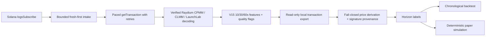

# Solana Trenches

**Rust/Solana data-infrastructure portfolio project for reliable, auditable launch-event research.** It turns targeted Solana program notifications into bounded, freshness-aware observations, then supports an entirely read-only historical research workflow. It is not a trading bot: it has no wallet, signer, order submission, transfer, or deployment path.

## The engineering problem

Solana log subscriptions provide fast but incomplete signatures, while full transaction detail arrives through RPC under provider rate limits. This project demonstrates how to bridge that gap without pretending that a best-effort scanner has perfect chain coverage: bound work, prioritize fresh work, preserve provenance, reject ambiguous protocol evidence, and carry quality limitations into later research.

**Relevant roles:** Junior Rust Developer · Solana Backend Developer · Blockchain Data/Indexer Engineer · Web3 Infrastructure Engineer.

## Stack

Rust 2021 (pinned to Rust 1.89), Tokio, Solana client/SDK 4.x, `reqwest` with rustls, `serde_json`, `dotenvy`, and an Anchor counter example kept in the workspace. The two production-facing crates are `ingestion` and `research`.

## Architecture



## What this demonstrates

- **Bounded, fresh-first ingestion:** fixed-capacity queues, monotonic event age, deduplication, and stale-work rejection make overload visible instead of accumulating an unbounded, misleading backlog.
- **Backpressure with explicit tradeoffs:** limited fetch jobs and a bounded result queue propagate pressure upstream; dropped or stale work is counted, not silently recast as coverage.
- **RPC resilience without rate-limit evasion:** one shared request-start gate, global throttling cooldown, fixed retry budget, HTTP deadlines, and reconnect backoff keep all workers within a provider budget.
- **Verified protocol parsing:** outer and inner Raydium instructions are scoped by known program IDs, discriminators, and account positions. Unknown or merely mentioned instructions are never called swaps.
- **Explainable momentum features:** per-launch 10/30/60-second windows record activity, rates, acceleration, a bounded deterministic score, and quality flags. The score is not a price or return prediction.
- **Auditable historical research:** local exports are derived only when LaunchLab instruction, mints, amounts, and attribution agree. Every derived observation can retain its source transaction signature.
- **Conservative evaluation:** labels require observed future prices; the backtest is chronological; paper simulation is deterministic, costed, quality-gated, and incapable of live execution.

See [architecture](docs/architecture.md), [engineering decisions](docs/engineering-decisions.md), [quick start](docs/quickstart.md), [project status](docs/status.md), and [portfolio material](docs/portfolio.md).

## Quick start: deterministic offline demo

From the repository root, with the pinned Rust toolchain available:

```bash
./scripts/offline-demo.sh
```

The script creates a temporary directory, reads only committed synthetic fixtures, and runs:

```text
synthetic transaction export → derive-prices → validate-prices → backfill
→ chronological backtest → paper-trade
```

It makes no network request and submits no transaction. Run it twice: the script compares the resulting observation, label, trade, and report files byte-for-byte. Details and expected counts are in [quick start](docs/quickstart.md#offline-demo).

## Development and validation

```bash
cargo fmt --check
cargo clippy -p ingestion -- -D warnings
cargo test -p ingestion
cargo clippy -p research -- -D warnings
cargo test -p research
cargo clippy --workspace -- -D warnings
cargo run -p research -- --help
```

`cargo test --workspace` additionally includes the Anchor integration test. It needs an SBF-built `target/deploy/solana_trenches.so`; see [status](docs/status.md#anchor-workspace-test-prerequisite). The normal ingestion and research test suites are offline.

For read-only scanner configuration, copy `ingestion/.env.example` to a local ignored `ingestion/.env`, supply only your own endpoints, and run `cargo run -p ingestion`. It starts listeners immediately; unlike the research CLI it has no help-only mode. Never commit endpoint URLs, wallet files, or generated exports.

## Historical pilot: what it does—and does not—show

The checked-in documentation records a historical, read-only LaunchLab pilot with **10 targets and 35 unique real observations**: two 1-minute labels, one 5-minute label, one 15-minute label, and no complete 1-hour label. All current V15 records retain conservative scanner warnings, so **zero rows meet the scanner-quality backtest gate**. These are historical data-coverage facts, not live metrics, a performance result, or evidence of trading profitability.

The currently checked-in docs do not substantiate the separate 1,661-transaction and 67-verified-swap-candidate figures, so this README intentionally does not present them as verified repository metrics.

Current limitations include best-effort confirmed WebSocket coverage, no historical replay or fork reconciliation, deliberate protocol scope, approximate fee-payer identity, and a sample too small for a meaningful holdout or predictive claim. More detail: [status](docs/status.md).

## Repository map

| Path | Purpose |
| --- | --- |
| `ingestion/` | Bounded WebSocket/RPC ingestion, Raydium decoding, momentum features, JSONL persistence |
| `research/` | Offline validation, derivation, labels, chronological reports, paper-only simulation |
| `research/fixtures/` | Committed synthetic, non-chain fixtures for the offline demo |
| `scripts/offline-demo.sh` | Reproducible no-network end-to-end demonstration |
| `docs/` | Architecture, decisions, setup, status, and interview-ready project material |
| `programs/solana-trenches/` | Separate Anchor counter example retained in the workspace |

## Safety and scope

Generated JSONL, raw transaction exports, `.env` files, wallet/key files, and build output are ignored. The project performs read-only RPC calls only when the scanner or explicit historical acquisition command is run. The default demo runs entirely offline. This repository is an engineering portfolio, not financial advice or a deployed production indexer.
